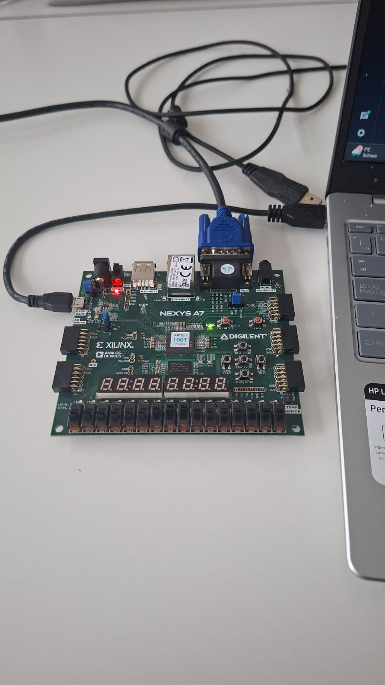
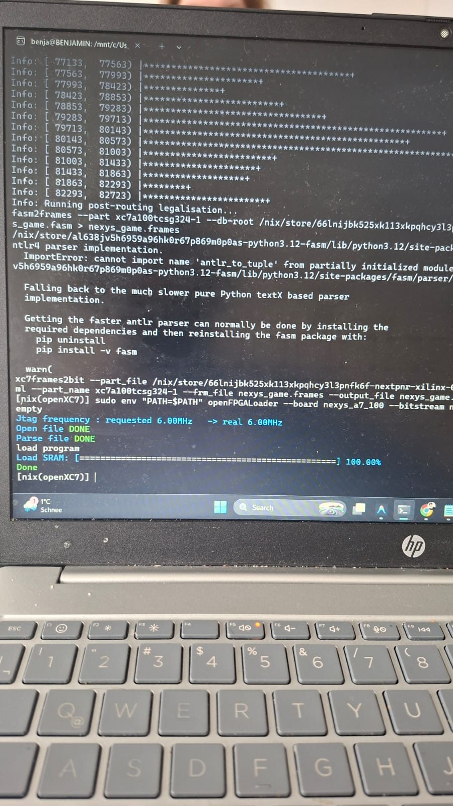
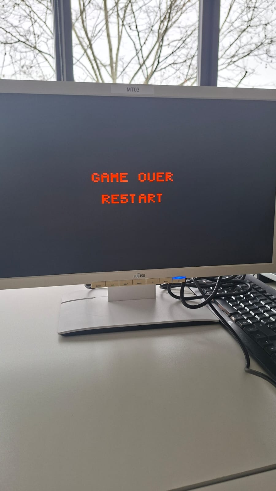

# Space Shooter FPGA - Verilog Game

---

## Overview
This project is a hardware-based "Space Shooter" game implemented in **Verilog HDL**, designed to run on a **Nexys A7 FPGA** with real-time visualization on a **VGA Monitor**.

The game logic is fully synthesized on the FPGA, handling video signal generation (640x480 @ 60Hz), game physics, collision detection, and user input processing.

🎥 **Watch the game in action:** [YouTube - Chip Invaders Demo](https://youtube.com/shorts/NVsZrk53b1Q)

---

## 🚀 Game Mechanics
The player controls a spacecraft in deep space with the following objectives:
- **Survival**: Dodge incoming meteors that move across the screen.
- **Combat**: Destroy meteors using the ship's laser to clear your path.
- **Progression**: Collect small scattered stars to increase your score.
- **Victory Condition**: Reach a total of **9 points** to successfully clear the level.

### Key Features
- **640x480 VGA Resolution**: Custom VGA controller for high-frequency 60Hz video output.
- **Dynamic Difficulty**: The game automatically increases meteor speed at 3, 5, and 7 points.
- **Real-time Interaction**: 
    - Smooth vertical ship movement.
    - Laser shooting mechanism.
- **HUD (Heads-Up Display)**: 
    - **Lives**: Visualized as red hearts.
    - **Score**: Digital on-screen counter (0-9).
- **Visuals**: 
    - Animated starfield background with parallax effect.
    - Procedural meteor generation using a PRNG (Pseudo-Random Number Generator).

---

## 🛠️ Build & Flash Process (WSL & FPGA)
This guide details the complete flow from Verilog source code to running the game on the Nexys A7 FPGA using **Windows Subsystem for Linux (WSL)**.

### Prerequisites
- **WSL 2** (Ubuntu recommended).
- **USBIPD-WIN**: To bridge the USB connection from Windows to WSL.
- **OpenFPGALoader**: For flashing the bitstream to the FPGA.
- **F4PGA / OXC7 Toolchain** (Yosys, Nextpnr, etc.): For synthesis and bitstream generation.

### Step 1: Toolchain Setup
Ensure you have the open source FPGA toolchain installed in your WSL environment.
```bash
# Example for installing dependencies (simplified)
sudo apt install git build-essential
# Follow the F4PGA or OSS CAD Suite installation guide for your specific distribution.
```

### Step 2: Synthesis & Bitstream Generation
We use a `Makefile` to automate the synthesis, placement, and routing process.

1. Navigate to the build directory:
   ```bash
   cd build_FPGA_NexysA7
   ```
2. Run the build command:
   ```bash
   make
   ```
   
   **What happens here?**
   - **Synthesis (Yosys)**: Converts Verilog code (`project.v`, `nexys_top.v`) into a logical netlist (`.json`).
   - **Place & Route (Nextpnr)**: Maps the logic to the Artix-7 FPGA cells (`.fasm`).
   - **Bitstream Creation**: Generates the final binary file (`nexys_game.bit`) and the ChipDB (`chipdb/*.bin`).

### Step 3: Connecting the FPGA to WSL (USBIPD)
Since WSL doesn't have direct access to USB ports, we tunnel the connection from Windows.

1. **Connect the Nexys A7** to your PC and turn it ON.
2. Open **PowerShell as Administrator** in Windows and list devices:
   ```powershell
   usbipd list
   ```
3. Locate the **Digilent USB Device** or **FTDI** (e.g., BUSID `1-2`) and bind it (only needed once):
   ```powershell
   usbipd bind --busid 1-2
   ```
4. Attach the device to WSL:
   ```powershell
   usbipd attach --wsl --busid 1-2
   ```

   
   *Figure 1: Nexys A7 connected and ready for flashing.*

### Step 4: Flashing the FPGA
Back in your **WSL terminal**, verify the device is visible:
```bash
lsusb
# You should see: Future Technology Devices International...
```

Now, program the FPGA:
```bash
sudo env "PATH=$PATH" openFPGALoader --board nexys_a7_100 --bitstream nexys_game.bit
```

   
   *Figure 2: Successful flashing process in the terminal.*

### Step 5: Play!
Connect your **VGA Monitor** to the Nexys A7. The game should appear immediately.

   
   *Figure 3: The game running on a real VGA monitor.*

---

## 🎮 Controls
Inputs are mapped to the FPGA buttons (via `nexys_top.v`):
- **BTN U (Up)**: Move Ship Up.
- **BTN D (Down)**: Move Ship Down.
- **BTN C (Center)**: Shoot / Start Game.
- **CPU_RESETN**: Reset Game.

---

## 📂 Architecture & Modules
The project follows a modular design for scalability:
- **`project.v`**: Top-level game logic.
- **`nexys_top.v`**: Wrapper interfacing the game logic with physical FPGA pins (Buttons, VGA, Clock).
- **`hvsync_generator.v`**: Generates standard VGA sync signals.
- **`ship.v`, `bullet.v`, `meteoritos.v`**: Game object logic.
- **`collisions.v`**: Central collision detection engine.
- **`hearts.v`, `numbers.v`**: HUD rendering (Lives and Score).
- **`stars.v`**: Background starfield effects.

---

## 🔮 Future Implementations
- **Boss Encounter**: A final boss battle triggered at 9 points.
- **Sound Effects**: Audio output via the FPGA's audio jack/PWM.

---

**Autor:** Benjamin
**Plataform:** Nexys A7 FPGA & Verilog
